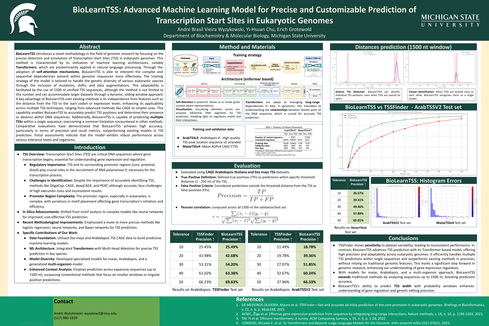

# BioLearnTSS

BioLearnTSS introduces a novel methodology in the field of genomic research by focusing on the precise detection and annotation of Transcription Start Sites (TSS) in eukaryotic genomes. This method is characterized by its utilization of machine learning architectures, notably Transformers, which are predominantly applied in natural language processing. Through the adoption of self-attention mechanisms, BioLearnTSS is able to interpret the complex and sequential dependencies present within genomic sequences more effectively. The training strategy of the model is tailored to handle the genetic diversity of various eukaryotic species through the inclusion of mutations, shifts, and data augmentations. This adaptability is facilitated by the use of 1500 nt verified TSS sequences, although the method is not limited to this number and can accommodate larger datasets through a dynamic, sliding window approach. A key advantage of BioLearnTSS over existing methods is its independence from features such as the distance from the TSS to the start codon or expression levels, enhancing its applicability across multiple TSS techniques, ranging from advanced methods like CAGE to simpler ones. This capability enables BioLearnTSS to accurately predict TSS positions and determine their presence or absence within DNA sequences. Additionally, BioLearnTSS is capable of predicting multiple TSSs within a single sequence, overcoming a common limitation encountered in other methods. Comparative evaluations have demonstrated that BioLearnTSS achieves high accuracy, particularly in terms of precision and recall metrics, outperforming existing models in TSS prediction. Initial assessments indicate that the model exhibits robust performance across various tolerance levels and organisms.

## Poster

## Contact

* André Wyzykowski: wyzykow2@msu.edu , abvwmc@gmail.com
*  (517) 980-1839

Grotewold lab
https://grotewold-lab.com/
